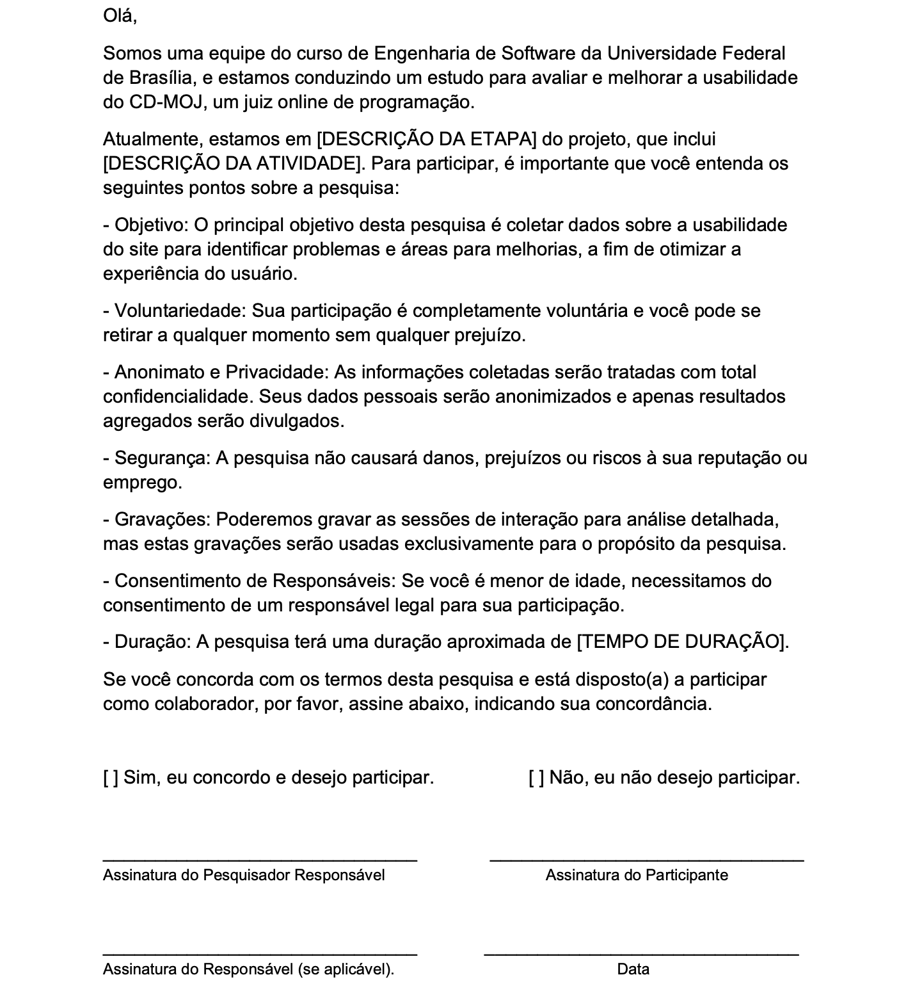

# <a>Aspectos Éticos</a>

## <a>Introdução</a>

Uma pesquisa ética deve priorizar o respeito pela dignidade e autonomia dos participantes, reconhecendo sua vulnerabilidade e garantindo que sua participação seja voluntária e informada. No Brasil, a Resolução [resolução nº 466/2012](./reso466.pdf) do Conselho Nacional de Saúde<a id="anchor_1" href="#REF1">^1^</a> estabelece diretrizes éticas para pesquisas envolvendo seres humanos, baseadas nos seguintes princípios:

- Autonomia: Este princípio enfatiza a necessidade de consentimento informado por parte dos participantes, protegendo indivíduos em situações de vulnerabilidade legal, como menores de idade e pessoas sob tutela. É crucial tratar os participantes com dignidade, respeitar sua autonomia e proteger sua vulnerabilidade.
- Beneficência: Exige uma análise minuciosa dos riscos e benefícios da pesquisa, tanto imediatos quanto futuros, e para indivíduos ou coletividades. O objetivo é maximizar os benefícios e minimizar os riscos e danos, que podem afetar diversas áreas da vida humana - física, psicológica, moral, intelectual, social, cultural ou espiritual.
- Não Maleficência: Este princípio visa prevenir danos previsíveis associados à pesquisa, sejam eles imediatos ou de longo prazo.
- Justiça e Equidade: Relaciona-se com a importância social da pesquisa e busca garantir benefícios significativos para os participantes, ao mesmo tempo que minimiza o ônus para os mais vulneráveis. É essencial assegurar que os interesses de todos os envolvidos sejam considerados igualmente em todas as fases do estudo.

## Termo de Consentimento 

Os Termos de Consentimento Livre e Esclarecido (TCLE) são fundamentais para esclarecer detalhadamente aos participantes de uma pesquisa sobre o que ela envolve, incluindo possíveis riscos e benefícios. Essa clareza permite que os indivíduos tomem uma decisão informada e voluntária sobre sua participação. O TCLE é essencial para garantir que os participantes estejam plenamente cientes e concordem com os termos antes de participar. Adicionalmente, em situações que envolvam gravações, incluindo o uso de voz e/ou imagem, a permissão explícita será obtida e documentada. Para pesquisas que envolvem seres humanos, é comum o uso de um modelo de TCLE, como o exemplificado na Figura 1, sempre que necessário.

<figure markdown>

<b>Figura 1</b> - Termo de Consentimento.

{width: 300}
</figure>

_Fonte: [Diego Sousa](https://github.com/DiegoSousaLeite), 2024_

## <a>Bibliografia</a>

> <a id="REF1" href="#anchor_1">1.</a> BRASIL. Resolução nº 466, de 12 de dezembro de 2012, que trata de pesquisas em seres humanos e atualiza a resolução 196. Brasília, DF: Diário Oficial da União, 2013. Disponível em: <<https://conselho.saude.gov.br/resolucoes/2012/Reso466.pdf>>. Acesso em: 06/05/2023.

## <a>Histórico de Versão</a>

| Versão| Data | Data Prevista de Revisão| Descrição  | Autor(es)  | Revisor(es) |
| ------- | ------ | ------ | ------- | -------- | -------- |
| `1.0` | 16/04/2024 | 18/04/2024 | Criação da página aspectos éticos. | [Diego Sousa](https://github.com/DiegoSousaLeite) | [Arthur Alves](https://github.com/Arthrok) e [Eric Silveira](https://github.com/ericbky) |
| `1.2` | 02/05/2024 | 03/05/2024 | Adição Termo de Consentimento | [Diego Sousa](https://github.com/DiegoSousaLeite) | [Arthur Alves](https://github.com/Arthrok) e [Eric Silveira](https://github.com/ericbky) |