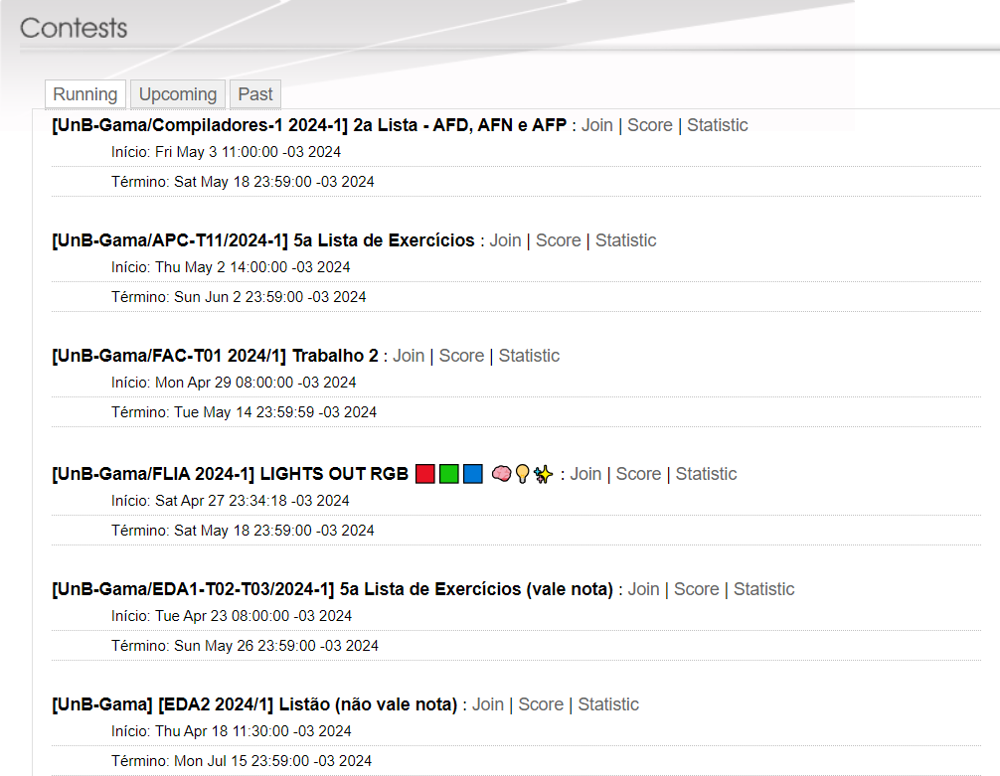
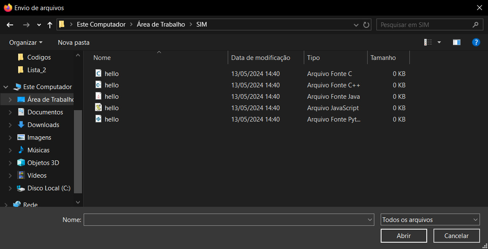
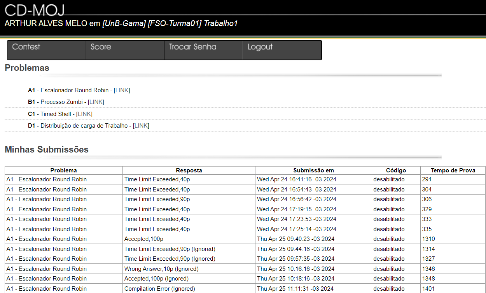

## <a>Introdução</a>

Este documento define critérios essenciais de usabilidade, que são fundamentais para orientar as prioridades no design de produtos. Ele também detalha o processo de avaliação que será implementado durante o desenvolvimento do projeto, estabelecendo quais padrões são aceitáveis e quais não são. A usabilidade é medida pela capacidade de usuários específicos alcançarem objetivos em contextos determinados com eficácia, eficiência e satisfação.<a id="anchor_1" href="#FRM1">^1^</a>

Para atingir os padrões de usabilidade estabelecidos, definimos Metas de Usabilidade essenciais. Essas metas servem como pilares fundamentais para alcançar as características de qualidade destacadas anteriormente no documento. Neste projeto, nosso foco será as metas de usabilidade definidas pelo autor Jakob Nielsen. As metas incluem Aprendizado, Eficiência, Eficácia, Memorização, Segurança e Utilidade. Estas são, como mencionado anteriormente, pilares fundamentais que direcionam a criação de interfaces intuitivas e acessíveis. Ao priorizar essas metas, pretendemos desenvolver soluções que não apenas atendam às necessidades operacionais do CD-MOJ, mas que também aprimorem a experiência geral do usuário, facilitando a interação com o sistema.

## <a>Metodologia</a>

Neste projeto, inicialmente, conduziremos uma avaliação detalhada para identificar quais das metas de usabilidade — Aprendizado, Eficiência, Eficácia, Memorização, Segurança e Utilidade — estão apresentando deficiências na plataforma. 

Essa avaliação envolverá testes de usabilidade realizando simulações do comportamento esperado dos usuários, considerando os atributos coletados na seção <a href="/2024.1-CD-MOJ/analise-de-requisitos/perfildeUsuario/">Perfil do Usuário</a>, sob diversos aspectos comportamentais no sistema. Com base nesses dados, ajustaremos nosso design e desenvolvimento para melhor alinhar o CD-MOJ com as necessidades e expectativas dos usuários, garantindo uma experiência mais intuitiva e eficaz. Isso nos permitirá avaliar como cada uma das metas está sendo incorporada ao sistema. Como resultado, as metas serão classificadas com base em seu cumprimento pelo sistema, determinando quais foram alcançadas e quais não.

## Descrição das Metas de Usabilidade
As metas descritas abaixo proporcionam uma compreensão clara sobre os principais objetivos que o sistema deve alcançar para oferecer uma experiência de usuário eficaz e agradável. <a id="anchor_2" href="#FRM2">^2^</a>

- <strong>Eficácia:</strong> Relaciona-se com a capacidade do produto em desempenhar efetivamente as funções esperadas, ou seja, se ele é eficaz em cumprir o propósito para o qual foi projetado.

- <strong>Eficiência:</strong> Refere-se a como o sistema auxilia o usuário a realizar suas atividades desejadas de forma econômica, minimizando o número de etapas necessárias para alcançar um objetivo.

- <strong>Segurança:</strong> Envolve a proteção do usuário contra situações perigosas e a prevenção de erros graves. O sistema deve oferecer mecanismos para que o usuário possa recuperar-se de erros ou desfazê-los, caso ocorram.

- <strong>Utilidade:</strong> Está relacionada às medidas e funcionalidades disponibilizadas ao usuário para realizar as tarefas desejadas de maneira eficaz e satisfatória.

- <strong>Aprendizado:</strong> Diz respeito à facilidade com que o usuário pode aprender a utilizar o sistema. O objetivo é permitir que o usuário aprenda a usar o sistema rapidamente e se torne competente na realização das tarefas.

- <strong>Memorização:</strong> Refere-se à capacidade do usuário de relembrar como usar o sistema após já ter aprendido. Isso é especialmente importante quando se trata de sistemas que não são utilizados com frequência, garantindo que o usuário retenha o conhecimento sobre o uso do sistema ao longo do tempo.

## <a>Avaliação das Metas de Usabilidade no CD-MOJ</a>

texto

### Eficácia
#### Pergunta Chave
O sistema serve ao propósito principal?

#### Avaliação
O CD-MOJ, como juiz online destinado a, essencialmente, alunos da FGA-UNB, tem como objetivo, principalmente, avaliar estudantes através de contests, que são conjuntos de problemas de programação. A análise da eficácia do sistema mostra que ele atende muito bem ao seu propósito. Os usuários conseguem participar dos contests e submeter soluções sem dificuldades, demonstrando que as funcionalidades essenciais do sistema funcionam de maneira eficiente e estão alinhadas com os objetivos educacionais e formativos da plataforma.

### Eficiência
#### Pergunta Chave
Quantos recursos são utilizados para realizar a tarefa específica?

#### Avaliação
Embora o CD-MOJ seja eficaz em permitir que os usuários realizem as funcionalidades principais, ele enfrenta desafios em termos de eficiência. Um dos principais problemas é a dificuldade que os usuários encontram ao tentar localizar um contest específico, devido à falta de recursos de pesquisa e filtros, veja na figura 1. Isso pode tornar a navegação pelo site mais demorada e menos intuitiva do que o necessário. A implementação de uma barra de pesquisa e de filtros poderia melhorar significativamente a eficiência do sistema, tornando a experiência do usuário mais direta e menos frustrante.

    <figure markdown>
    
<b>Figura 1</b> -  Meta de usabilidade Eficiência.

    {width: 300}
    </figure>

  Fonte: [CD-MOJ](https://moj.naquadah.com.br/cgi-bin/index.sh).

### Segurança
#### Pergunta Chave
O sistema previne o usuário de erros ou ações indesejáveis? O sistema recupera as ações anteriores?

#### Avaliação
O CD-MOJ implementa alguns mecanismos de segurança, como o registro das submissões dos problemas, que são monitoradas e marcadas em uma tabela até sua conclusão. No entanto, um aspecto que compromete a segurança é a interface de envio de soluções, que permite a submissão de arquivos em linguagens não especificadas para o problema, veja na figura 2. Isso aumenta o risco de erros, pois o usuário pode enviar um arquivo em uma linguagem incompatível sem um aviso claro, evidenciando uma área que necessita de melhorias para prevenir equívocos e melhorar a experiência do usuário. Este problema pode ser resolvido por meio de scripts especificando o tipo de arquivo, além de deixar claro as linguagens permitidas de forma visual.

    <figure markdown>
    
<b>Figura 2</b> -  Meta de usabilidade Segurança.

    {width: 300}
    </figure>

  Fonte: [CD-MOJ](https://moj.naquadah.com.br/cgi-bin/index.sh).

### Utilidade
#### Pergunta Chave
O sistema oferece ao usuário a funcionalidade certa segundo o contexto?

#### Avaliação
A plataforma disponibiliza as ferramentas essenciais para que o usuário alcance com sucesso o seu objetivo final.

### Aprendizagem
#### Pergunta Chave
É fácil aprender a usar?

#### Avaliação
Embora o CD-MOJ permita realizar as funções principais, ele apresenta desafios significativos para novos usuários, como na localização de contests específicos. Informações críticas como "Time Limit Exceeded", "Compilation Error" e "Runtime Error" são apresentadas sem explicações detalhadas ou fácil acesso ao FAQ enquanto se está com a página aberta no contest, veja na figura 3. Isso dificulta a compreensão dos erros, deixando o usuário confuso e impactando negativamente a curva de aprendizagem. A clareza na apresentação de informações e a acessibilidade de recursos de ajuda são essenciais para facilitar o processo de aprendizagem na plataforma.

    <figure markdown>
    
<b>Figura 3</b> -  Meta de usabilidade Aprendizagem.

    {width: 300}
    </figure>

  Fonte: [CD-MOJ](https://moj.naquadah.com.br/cgi-bin/index.sh).

### Memorização
#### Pergunta Chave
Que tipo de suporte é oferecido ao usuário para auxiliá-lo na realização das tarefas, especialmente os itens não recorrentes?

*A maior regra para essa meta é: O usuário não deve ser obrigado a reaprender a usar o serviço toda vez que o acessa.*

#### Avaliação
A capacidade de memorização da plataforma CD-MOJ é boa, permitindo que os usuários relembram procedimentos básicos após um período de inatividade. No entanto, a experiência de memorização não é isenta de problemas. Os usuários enfrentam dificuldades devido a falhas e a falta de suporte direto em tarefas básicas. Apesar de uma vez aprendidos os processos se tornarem mais acessíveis, a presença de inconsistências e a ausência de guias de suporte mais visíveis podem comprometer a eficiência com que os usuários retomam suas atividades na plataforma após pausas prolongadas.

### Conclusão
Neste documento, avaliamos várias metas de usabilidade essenciais para o CD-MOJ, um sistema destinado à avaliação de estudantes. Constatamos se que a plataforma atende bem à meta de Eficácia, executando suas funções conforme o esperado. No entanto, identificamos áreas que necessitam de melhoria significativa em relação às outras metas, especialmente Eficiência, Segurança e Aprendizado.

Áreas de Melhoria:

- Eficiência: Implementar uma barra de pesquisa e filtros avançados ajudaria os usuários a localizar contests de forma mais rápida e eficaz. Isso poderia reduzir o tempo gasto na navegação e melhorar a experiência geral do usuário.
- Segurança: Para minimizar os erros de submissão, seria útil adicionar etiquetas claras que especifiquem as linguagens de programação aceitas para cada problema. Além disso, poderia ser implementada uma validação no lado do servidor para rejeitar arquivos que não correspondam às especificações requeridas, assim evitando submissões erradas.
- Aprendizado: Melhorar a visibilidade e o acesso às FAQs durante as sessões ativas poderia ajudar os usuários a compreenderem melhor os processos e erros comuns. Incluir tooltips ou uma seção de ajuda contextual poderia também fornecer orientações imediatas aos usuários conforme eles navegam pela plataforma.

## <a>Referência Bibliográfica</a>

> <a id="FRM1" href="#anchor_1">1.</a> NIELSEN, Jacob. Designing Web Usability: The Practice of Simplicity Peachpit Press, la edição 1999

> <a id="FRM2" href="#anchor_2">2.</a> Diana Fournier. As 6 metas de Usabilidade. MEDIUM, 2016. Disponível em: https://medium.com/vivareal-ux-chapter/as-6-metas-de-usabilidade-9491442fd56a. Acesso em: 21 out. 2023.

## <a> Bibliografia </a>

> HENRIQUE, Matheus; FERREIRA, Rafael. Metas de Usabilidade. Repositório do Grupo Bilheteria Digital da disciplina de Interação Humano Computador da Universidade de Brasília, 2023. Disponível em: https://github.com/Interacao-Humano-Computador/2023.1-BilheteriaDigital/blob/main/docs/analise-de-requisitos/metas-usabilidade.md. Acesso em: 13/05/2024.

## <a> Histórico de versão </a>
|Versão|Data|Data Prevista de Revisão|Descrição|Autor|Revisor|
| :------: | :----------: |:-----------: | :----------------------: | :---------: |:---------: |
| `1.0` | 12/05/2024 | 13/05/2024 |Criação da Documentação das Metas de Usabilidade | [Arthur Alves](https://github.com/Arthrok) | Luiz Gustavo e Diego Sousa |